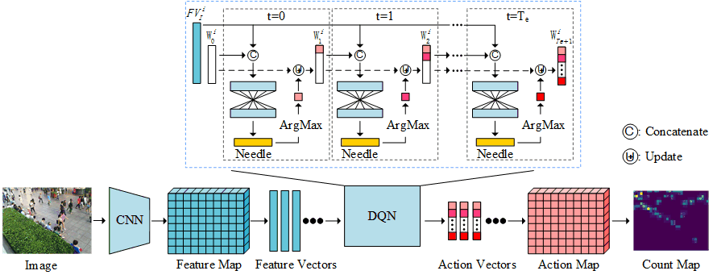

# LibraNet


This repository includes the official implementation of LibraNet for crowd counting, presented in our paper:

**[Weighing Counts: Sequential Crowd Counting by Reinforcement Learning](https://arxiv.org/abs/2007.08260)**

Proc. European Conference on Computer Vision (ECCV), 2020

Liang Liu<sup>1</sup>, [Hao Lu](https://sites.google.com/site/poppinace/)<sup>2</sup>, Hongwei Zou<sup>1</sup>, Haipeng Xiong<sup>1</sup>, Zhiguo Cao<sup>1</sup>, [Chunhua Shen](http://cs.adelaide.edu.au/~chhshen/)<sup>1</sup>

<sup>1</sup>Huazhong University of Science and Technology

<sup>2</sup>The University of Adelaide, Australia

### Model Structure
<p align="left">
  
</p>

## Installation
The code has been tested on Python 3.7.6 and PyTorch 1.4.0. Please follow the
official instructions to configure your environment. See other required packages
in `requirements.txt`.

## Data structure 
* Download the pre-processed ShanghaiTech Part_A training set from: [BaiduYun (168.3
MB)](https://pan.baidu.com/s/1VENBbBBbIoS929DMaN5Uug) (code: ix2v) or [OneDrive (172.3 
MB)](https://1drv.ms/u/s!AkNf_IPSDakh8jOOQ8P3tlaQzq9b?e=ugfXjM)

* Download the ShanghaiTech Part_A testing set from: [BaiduYun (23.7
MB)](https://pan.baidu.com/s/1lagHgw3gshIBmPTHIbkzRw) (code: h7a6) or [OneDrive (24.3 
MB)](https://1drv.ms/u/s!AkNf_IPSDakh8XEAoq489DxQQ_iF?e=OjH77y)

* Unzip the datasets and move 'Train' and 'Test' folder into './data', the path structure should look like this:

````
$./data/
├──── Train
├──── Test
````

## Training
* Download the VGG16 backbone pretrained on SHT Part_A from  [[BaiduYun (56.1
MB)](https://pan.baidu.com/s/1V5kVYdyF7Cs5SVlyVm2zGg) (code: 3cfp) or OneDrive (57.5 
MB)](https://1drv.ms/u/s!AkNf_IPSDakh8jLP6doilJNgdr4g?e=JcgOMV). 

* Put the backbone model like './backbone.pth.tar'.

````
$./backbone.pth.tar
````
**Train LibraNet on SHT Part_A Dataset**
```python
python train.py
```

## Inference
**Pre-trained Model on SHT Part_A dataset**
* Download the model from: [[BaiduYun (68.3
MB)](https://pan.baidu.com/s/1fBTr4S7vnXgoMLb3pbWT4g) (code: 20um) or OneDrive (70 
MB)](https://1drv.ms/u/s!AkNf_IPSDakh8XBVTepnGq2J_YjN?e=lJCCUw) 
* The result of this model is: mae=55.5, mse=93.9. However, if the version pythorch is less than 1.4.0 (1.3.1 for example), the result might be: mae=56.3 , mse=95.2. Now I try to find the reason.
* Move the model into the folder, and the path structure should like this:the

````
$./trained_model/
├──── LibraNet_SHT_A.pth.tar
````

**Evaluation**
```python
python Test_SHT_A.py
```
## Citation
If you find this work or code useful for your research, please cite:
```
@article{liu2020WeighingCounts,
  title={Weighing Counts: Sequential Crowd Counting by Reinforcement Learning},
  author={Liu, Liang and Lu, Hao and Zou, Hongwei and Xiong, Haipeng and Cao, Zhiguo and Chun, Huashen},
  journal={Proc. Eur. Conf. Computer Vision},
  year={2020}
}
```

## Permission
The code are only for non-commercial purposes. Copyrights reserved.

Contact: 
Liang Liu (wings@hust.edu.cn)
Hao Lu (poppinace@foxmail.com)
